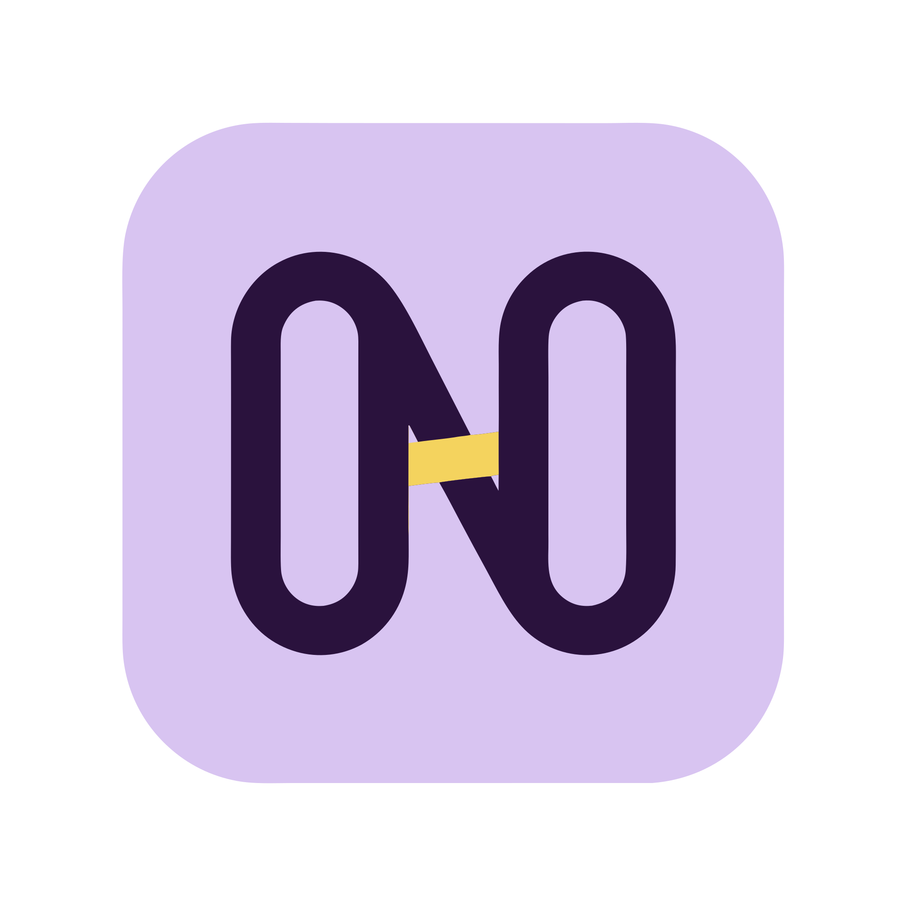
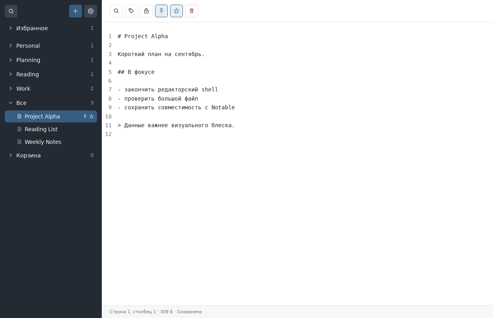

<!-- Copyright 2026 Evgeniy Udodov -->
<!-- SPDX-License-Identifier: GPL-3.0-only -->

<p align="center">
  
</p>

<h1 align="center">Notrum</h1>

<p align="center">
  <strong>A native home for your notes and the things you read.</strong><br>
  Plain Markdown. Local files. Yours to keep.
</p>

<p align="center">
  <a href="https://github.com/notrum-ai/notrum/actions/workflows/ci.yml?query=branch%3Alatest+event%3Apush"></a>
  <a href="https://github.com/notrum-ai/notrum/releases/latest"></a>
  <a href="Cargo.toml"></a>
  <a href="LICENSE"></a>
</p>

<p align="center">
  <a href="#features">Features</a> ·
  <a href="#build-and-run">Get started</a> ·
  <a href="docs/user-guide.md">User guide</a> ·
  <a href="https://github.com/notrum-ai/notrum/releases">Releases</a> ·
  <a href="CONTRIBUTING.md">Contribute</a>
</p>

---

Your notes should be easy to write, easy to find, and easy to take with you.
Notrum brings Markdown editing, tagged notes, and an RSS/Atom reader into one
native desktop application. Keep project ideas, everyday notes, and reading
lists together in a folder you control.

Notrum stores your writing as ordinary files in a
Notable-style workspace. Open them in another editor, track them with Git,
or back them up with your own tools. No cloud account is required.



<p align="center"><sub>Tagged notes and Markdown editing in the native interface. Demo workspace captured in the Linux test environment.</sub></p>

## Features

### 📝 Markdown you own

Write in plain Markdown with YAML front matter. Your workspace's `notes/`
directory is the source of truth, and opening it never rewrites existing notes.
Unknown metadata and unrelated files are preserved, so your writing stays
portable and works with tools you already use.

### 🗂 A place for every thought

Organize notes with tag-based categories, favorites, and pins. Arrange them
manually or choose automatic sorting, then use local search to find what you
need. Soft deletion lets you move notes out of the way without immediately
removing their files.

### ✍️ Keep your writing moving

Autosave, crash recovery, and external change detection help preserve your work.
Open existing `.md`, `.markdown`, and `.txt` files directly from your file
manager and edit them in place, without moving them into a workspace.

### 📰 Reading alongside writing

Follow RSS and Atom feeds in the same application as your notes.
A native reader presents article excerpts and read status; use `J` and `K`
to move between entries, or open the original article in your browser.

### 🔐 Privacy where it matters

Protect individual note bodies with a workspace password and authenticated
age encryption. Filenames and YAML metadata, including titles and tags,
remain readable. The [storage and security guide](docs/storage.md) explains
what is protected and how to keep backups safe.

### 🦀 Native from the ground up

Built with Rust and Floem, with no WebView or JavaScript runtime and no database
holding your notes. The interface offers 17 language variants, with English
as the default. Build for Apple Silicon macOS, Linux, or Windows x64.

<details>
<summary><strong>AI settings — groundwork for upcoming assistant features</strong></summary>

Connect OpenAI or Anthropic, keep API keys in the system credential store,
and configure named model/effort aliases with an editable default. Settings
apply across workspaces. Connection checks only retrieve the model catalog
and never send notes. **Assistant commands and text generation are not
implemented yet.** See the [AI settings guide](docs/user-guide.md#ai-settings).

</details>

## Project status

Notrum is in early development. The interface defaults to English and offers
17 language variants in Settings → General → Language.
Native builds target **Apple Silicon Macs**. Linux release binaries can be
built through Docker for the container's architecture. Portable Windows x64
builds target Windows 10/11 on local NTFS. Cross-compilation and actual Windows
acceptance are separate checks; see the [Windows guide](docs/windows.md).

Native macOS builds use an ad-hoc integrity signature that does not identify an Apple-registered
developer.
Known dependency warnings and the remaining work before distributing binaries
are documented in the [development guide](docs/development.md).

Your workspace's `notes/` directory holds the authoritative note files.
Opening a workspace does not migrate or rewrite existing notes. Encryption
protects the note body; filenames and YAML metadata, including titles and tags,
remain readable. Read the [storage and security guide](docs/storage.md) before
managing backups or removing local state. Recovery files can contain unsaved
work and must not be treated as disposable cache.

## Build and run

Choose your platform below. Release archives are available from
[GitHub Releases](https://github.com/notrum-ai/notrum/releases); read the
[project status](#project-status) and platform notes before installing.

<details open>
<summary><strong>macOS · Apple Silicon</strong></summary>

Requirements: an Apple Silicon Mac, Docker with Docker Compose and a running
Docker engine, Xcode Command Line Tools, and `python3`. A preinstalled Rust
toolchain is not required. Clone the repository, then build the application:

```sh
git clone https://github.com/notrum-ai/notrum.git
cd notrum
make build-macos
open dist/Notrum.app
```

A release downloaded from GitHub requires explicit approval until Notrum is
Developer ID signed and notarized. Try to open `Notrum.app` once, then open
**System Settings → Privacy & Security**, scroll to **Security**, choose
**Open Anyway**, and confirm the launch. macOS offers this override for about an
hour after the failed launch attempt. Only approve an archive whose checksum
matches the release's `SHA256SUMS`.

On first launch, choose a workspace or create one through the application.
To open an existing workspace explicitly:

```sh
open dist/Notrum.app --args /absolute/path/to/workspace
```

`make build-macos` downloads pinned Rust 1.88.0 into the ignored `.host-build/`
directory and builds with the system macOS SDK. It does not change your global
Rust installation or shell profile. It builds the application in release mode
and packages it as `dist/Notrum.app`. `make build` remains an alias for this
command.

To try generated demo notes:

```sh
make demo-data
open dist/Notrum.app --args "$PWD/examples/demo-workspace"
```

The demo command resets the generated demo notes. Use a separate workspace
for your own writing.

</details>

<details>
<summary><strong>Linux · Docker container architecture</strong></summary>

With Docker Compose and a running Docker engine, build an optimized Linux
executable using the pinned toolchain (no host Rust installation required):

```sh
make build-linux
```

The stripped release binary is written to `dist/linux/<architecture>/notrum`,
where the architecture matches the Docker container: `aarch64` on Apple
Silicon by default, or `x86_64` on an Intel/AMD host. Build on the matching
architecture for the destination Linux machine. The package also includes a desktop entry, icon, and optional `Register.py` script.
Run `python3 Register.py` on the destination Linux desktop to add Notrum to
Open With, or `python3 Register.py --remove` to remove that registration.
The script does not change default applications.

The command also works from
macOS, but the resulting executable runs only on Linux.

On Linux, launch it with an optional workspace path:

```sh
./dist/linux/$(uname -m)/notrum /absolute/path/to/workspace
```

This is a dynamically linked binary, not a
self-contained application bundle. A compatible Linux desktop with X11 or
Wayland, the corresponding system libraries, fonts, GTK4 (4.0 or newer), and an XDG desktop portal
for file dialogs is required. See the [development guide](docs/development.md)
for build verification and release limitations.

</details>

<details>
<summary><strong>Windows · Windows 10/11 x64</strong></summary>

Build on macOS or Linux with Docker Compose:

```sh
make build-windows
make test-windows-build
```

Copy `dist/windows/x86_64/` to a Windows computer and run `Notrum.exe`.
Any required non-system runtime DLLs are included beside the executable.
The application is portable, unsigned, and runs without a console window.
The existing `make build` command still builds the macOS application.
For optional Open With registration, run `powershell -NoProfile -File .\Register.ps1`
in the package directory; add `-Remove` to unregister. Defaults are unchanged.

Settings use `%USERPROFILE%\.notrum.cfg`, falling back to
`%HOMEDRIVE%%HOMEPATH%\.notrum.cfg`. English remains the default language;
all 17 language variants and saved workspace selection are available.

Run the supplied test kit and complete the native UI checklist before treating
that Windows build as validated. Instructions, supported filesystem boundaries,
and known validation limits are in [docs/windows.md](docs/windows.md).

</details>

## Opening external files

On every supported OS the executable accepts:

```sh
notrum --workspace /absolute/path/to/workspace --open first.md second.txt
notrum first.md second.markdown
```

A single directory argument still selects a workspace. Relative paths are
resolved against the launch directory; use `--` before paths beginning with `-`.
When no workspace is configured, select one in the startup dialog; the requested
files wait until that choice. Files stay in their original locations.

Linux and Windows may start another process when opening files from the desktop.
Finder delivers files to the running macOS application. There is no inter-instance
message queue or single-instance requirement.

## Documentation and contributions

| Guide | What you'll find |
| --- | --- |
| [User guide](docs/user-guide.md) | Workspaces, notes, external files, and feeds |
| [Storage and security](docs/storage.md) | File layout, recovery, encryption, and backups |
| [Development](docs/development.md) | Toolchain, checks, benchmarks, and packaging |
| [GitHub CI](docs/ci.md) | Linux, macOS, and Windows checks, caches, and artifacts |
| [Publishing](docs/publishing.md) | `make publish`, patch versions, and GitHub Releases |
| [Contributing](CONTRIBUTING.md) | Reporting bugs and submitting changes |
| [Security policy](SECURITY.md) | Reporting vulnerabilities privately |

The CI badge follows the moving `latest` release tag and turns green when the workflow
passes, including tests, builds, UI checks, and audits. `make publish` updates
`latest` after publishing each release, so new commits on `master` do not change
this badge. It may show no data until the first `latest` CI run finishes.

Found a bug or have an idea? [Open an issue](https://github.com/notrum-ai/notrum/issues)
or read the [contribution guide](CONTRIBUTING.md) to help shape Notrum.

## License

Copyright 2026 Evgeniy Udodov.

Notrum's own code, scripts, documentation, and application artwork are licensed
under the **GNU General Public License version 3 only** (`GPL-3.0-only`).
See [LICENSE](LICENSE) for the full terms. Notrum comes without warranty.
Third-party dependencies retain their respective licenses; the project's
license does not replace them.
